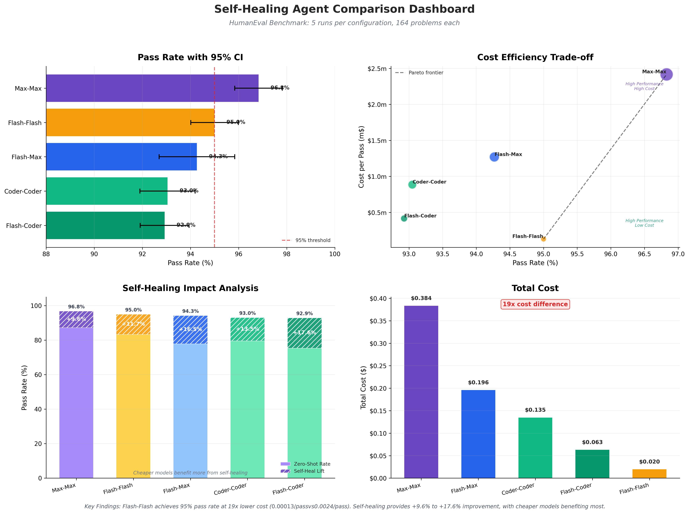

# Self-Healing Code Agent

An autonomous, iterative Python code generation and fixing system using **LangGraph** for research on self-correction and Reflexion in code generation.

## 🎯 Overview

This project implements a self-healing code agent that automatically generates, executes, and fixes Python code through a cyclic workflow. The agent uses LLMs for code generation and critique, and E2B sandboxes for safe code execution.

**Research Focus**: This project explores the cost-benefit analysis of using self-healing frameworks with multiple LLM iterations versus single-shot approaches with expensive frontier models. By combining cheaper models in a coder-critic loop with intelligent safeguards, the framework aims to match or exceed the quality of expensive models while potentially reducing total token costs.

### Architecture

The agent follows a **cyclic three-node workflow** implemented with LangGraph:

```
     ┌─────────────┐
┌──► │  Generator  │  - Generates or fixes Python code using LLM
│    └──────┬──────┘
│           │
│           ▼
│    ┌─────────────┐
│    │  Executor   │  - Runs code in E2B sandbox
│    └──────┬──────┘  - Captures output and errors
│           │
│           ▼
│    ┌─────────────┐
│    │   Critic    │  - Analyzes results and provides feedback
│    └──────┬──────┘  - Decides: iterate or complete
└───────────┤
            ▼
       [PASS/FAIL]
```

**Key Features:**
- **Autonomous**: Iteratively fixes code without human intervention
- **Safe Execution**: Uses E2B sandboxes for isolated code execution
- **Reflexion Pattern**: Critic provides feedback that guides the next iteration
- **Intelligent Safeguards**: Detects stuck states and truncated responses to prevent wasted iterations
- **Configurable**: Supports OpenAI, Anthropic and Qwen models with flexible termination policies
- **Cost-Aware**: Tracks token usage and costs with early termination options
- **Statistical Analysis**: Multi-run benchmarking with 95% confidence intervals
- **Visualization**: 4-panel dashboard for cost-performance comparison
- **Research-Oriented**: Designed for experimentation with self-correction techniques

## 🚀 Quick Start

### Prerequisites

- Python 3.9 or higher
- API keys for LLM provider
- E2B API key for sandbox execution

### Installation

1. Clone the repository:
```bash
git clone https://github.com/RavindraTarunokusumo/self-healing.git
cd self-healing
```

2. Install dependencies:
```bash
pip install -r requirements.txt
```

3. Set up environment variables:
```bash
# Create a .env file with your API keys
echo "QWEN_API_KEY=your_qwen_key_here" >> .env
echo "OPENAI_API_KEY=your_openai_key_here" > .env
echo "ANTHROPIC_API_KEY=your_anthropic_key_here" >> .env
echo "E2B_API_KEY=your_e2b_key_here" >> .env
```

### Usage

**Basic Usage:**

```python
from self_healing import SelfHealingAgent

# Create an agent with safeguards (Default CLI arguments)
agent = SelfHealingAgent(
    coder_model_provider="qwen",
    coder_model_name="qwen-flash",
    critic_model_provider="qwen",
    critic_model_name="qwen3-max",      # Use a more powerful model for the critic
    coder_max_tokens=1024,              # Adjust as needed
    critic_max_tokens=4096,             # Adjust as needed
    coder_temperature=0.7,              # Temperature for code generation
    critic_temperature=0.7,             # Temperature for code review
    max_iterations=5,
)

# Define what you want to build
specification = """
Create a function that takes a list of numbers and returns
the sum of all even numbers in the list.
"""

# Run the self-healing workflow
result = agent.run(specification)

# Access the final code and results
print(result["code"])
print(f"Completed: {result['is_complete']}")
print(f"Termination reason: {result['termination_reason']}")
print(f"Iterations: {result['iteration']}")
```

**Run the example:**

```bash
python main.py
```

## 🏗️ Architecture Details

### 1. Generator Node

**Purpose**: Generate or fix Python code based on specifications and feedback.

- **First iteration**: Generates code from scratch based on the specification
- **Subsequent iterations**: Fixes code based on execution results and critic feedback

### 2. Executor Node

**Purpose**: Execute code safely and capture results.

- Runs code in isolated E2B sandbox environment
- Captures stdout, stderr, and error traces
- Prevents harmful code from affecting the host system
- Returns structured execution results

### 3. Critic Node

**Purpose**: Analyze execution results and guide the next iteration.

- Evaluates if code meets the specification
- Checks for errors and edge cases
- Provides specific, actionable feedback for fixes
- Approves code when it's correct (breaking the cycle)

### State Management

The `AgentState` TypedDict tracks information across nodes:

```python
{
    "specification": str,           # Original requirements
    "code": str,                   # Current code version
    "test_code": str,              # Unit tests (from benchmarks)
    "entry_point": str,            # Function name to implement
    "execution_output": str,       # Sandbox output
    "execution_error": str,        # Error messages
    "is_infrastructure_error": bool, # Infrastructure error flag
    "critic_feedback": str,        # Critique and suggestions
    "feedback_history": list,      # All feedback for stuck detection
    "iteration": int,              # Current iteration count
    "max_iterations": int,         # Iteration limit
    "is_complete": bool,           # Success flag
    "termination_reason": str      # Why workflow ended
}
```

### Workflow Control

The workflow uses conditional edges to control iteration based on multiple conditions (checked in order):

1. **Code Approved** → End workflow (termination_reason: "approved")
2. **Infrastructure Error** → End workflow (termination_reason: "infrastructure_error", always terminates)
3. **Response Truncated** (with early termination enabled) → End workflow (termination_reason: "truncated")
4. **Stuck State Detected** (with early termination enabled) → End workflow (termination_reason: "stuck")
5. **Max Iterations Reached** → End workflow (termination_reason: "max_iterations")
6. **Otherwise** → Continue to next iteration

The `termination_reason` field enables detailed analytics on why workflows ended, which is crucial for cost-benefit analysis.

## 🔧 Configuration

### Model Providers

**Qwen:**
```python
agent = SelfHealingAgent(
    model_provider="qwen",
    model_name="qwen-flash",
    max_iterations=5
)
```

**Anthropic:**
```python
agent = SelfHealingAgent(
    model_provider="anthropic",
    model_name="claude-3-5-sonnet-20241022",
    max_iterations=5
)
```

### Iteration Control

Adjust `max_iterations` to control how many times the agent will attempt to fix the code:

```python
agent = SelfHealingAgent(max_iterations=5)  # More attempts for complex tasks
```

### Critic Feedback Safeguards

The agent includes intelligent safeguards to prevent wasted tokens when the critic cannot provide useful feedback.

**Problem**: When the critic cannot find a solution, it may exhaust its token limit reasoning without returning actionable feedback, wasting tokens on unproductive iterations. Additionally, infrastructure errors (E2B/network failures) should not waste tokens on critic analysis.

**Solution**: Three detection mechanisms with configurable early termination:

#### 1. Infrastructure Error Detection

Detects E2B/network errors and skips the critic LLM call entirely to save tokens:

```python
agent = SelfHealingAgent(
    # No configuration needed - always active
    # Detects: 403, 401, 402, 429, 500, 502, 503, 504, "sandbox execution failed"
)
```

- Checks execution errors for infrastructure patterns
- Sets `is_infrastructure_error=True` to skip critic entirely
- Always terminates immediately (no configuration needed)
- Saves critic LLM tokens on problems that cannot run
- Termination reason: `infrastructure_error`

#### 2. Truncation Detection

Detects when the critic's response is truncated due to hitting token limits:

```python
agent = SelfHealingAgent(
    critic_max_tokens=4096,
    early_termination_on_truncation=True  # End immediately if truncated
)
```

- Checks `finish_reason` (OpenAI/Qwen) or `stop_reason` (Anthropic) metadata
- Appends `[TRUNCATED]` marker to feedback for visibility
- Optionally terminates workflow early to save costs

#### 3. Stuck State Detection

Identifies when the critic provides identical feedback repeatedly:

```python
agent = SelfHealingAgent(
    enable_stuck_detection=True,           # Track feedback history
    stuck_detection_threshold=2,           # 2 identical feedbacks = stuck
    early_termination_on_stuck=True        # End immediately if stuck
)
```

- Tracks all critic feedback when enabled
- Compares last N feedbacks (configurable threshold)
- Normalizes feedback (strip whitespace, lowercase) to avoid false positives
- Optionally terminates early or warns and continues

#### CLI Usage

```bash
# Enable all safeguards
python src/main.py --benchmark humaneval --from-hub \
    --enable-stuck-detection --stuck-threshold 2 \
    --early-termination-on-stuck \
    --early-termination-on-truncation

# Stuck detection without early termination (warns only)
python src/main.py --benchmark humaneval --from-hub \
    --enable-stuck-detection

# Early termination on truncation only
python src/main.py --benchmark humaneval --from-hub \
    --early-termination-on-truncation
```

#### Benefits

- **Cost Savings**: Early termination prevents wasted iterations on unsolvable problems
- **Better Analytics**: Track termination reasons to understand failure modes
- **Configurable**: Tune aggressiveness based on your cost/success trade-offs
- **Backward Compatible**: All features opt-in, default behavior unchanged

## 📊 Benchmarking

The agent supports running on standard coding benchmarks for evaluation:

### Supported Benchmarks

- **HumanEval**: OpenAI's 164 function completion problems
- **MBPP**: Google's Mostly Basic Python Problems dataset

### Running Benchmarks

```bash
# Run HumanEval from HuggingFace Hub
python src/main.py --benchmark humaneval --from-hub

# Run specific problem
python src/main.py --benchmark humaneval --from-hub --task-id "HumanEval/0"

# Run first 10 problems with safeguards
python src/main.py --benchmark humaneval --from-hub --num-problems 10 \
    --enable-stuck-detection --early-termination-on-stuck \
    --output results.json

# Compare different model combinations
python src/main.py --benchmark humaneval --from-hub \
    --coder-provider openai --coder-model gpt-3.5-turbo \
    --critic-provider anthropic --critic-model claude-3-5-sonnet-20241022 \
    --output gpt35_claude.json
```

### Benchmark Results

Results are saved in JSON format with detailed information:

```json
{
    "benchmark_run_metadata": {
        "benchmark": "humaneval",
        "from_hub": true,
        "benchmark_path": null,
        "task_id": null,
        "num_problems": 164,
        "num_problems_requested": null,
        "timestamp": "2026-01-13T22:14:51.109239"
  },
    "models_metadata": {
        "coder_provider": "qwen",
        "coder_model": "qwen-flash",
        "critic_provider": "qwen",
        "critic_model": "qwen3-max",
        "coder_max_tokens": 1024,
        "critic_max_tokens": 8192,
        "coder_temperature": 0.7,
        "critic_temperature": 0.7,
        "max_iterations": 5
  }
},
{
    "problems_results": [
    {
        "task_id": "HumanEval/0",
        "entry_point": "has_closed_elements",
        "is_complete": true,
        "termination_reason": "approved",
        "iterations": 2,
        "token_usage": {...},
        "cost": {...}
    },
  ]
},
{
    "benchmark_summary": {
        "problems": {...},
        "iterations": {...},
        "termination_reasons": {...},
        "token_usage": {...},
        "cost": {...}
    }
}
```

The summary includes:
- Pass rate and average iterations
- Total token usage (coder vs. critic)
- Total cost breakdown by model
- Per-problem termination reasons for failure analysis

### Analyzing Multi-Run Results

For statistical rigor, run benchmarks multiple times and aggregate results:

```bash
# Aggregate results from multiple runs
python scripts/analyze_results.py --results-dir results

# Outputs: results/summary.json, results/comparison.csv
```

### Visualizing Results

Generate a comprehensive 4-panel comparison dashboard:

```bash
# Generate dashboard from comparison data
python scripts/visualize_results.py

# Custom paths
python scripts/visualize_results.py --input results/comparison.csv --output results/dashboard.png

# Generate both PNG and PDF (vector graphics)
python scripts/visualize_results.py --format both
```

## 📈 Results

Comprehensive comparison study using the Qwen family of models on the HumanEval benchmark (164 problems, 5 runs per configuration):

### Performance Metrics

| Configuration | Pass Rate | 95% CI | Zero-Shot | Self-Heal Lift | Avg Iterations |
|---------------|-----------|---------|-----------|----------------|----------------|
| **max-max** | 96.8% ± 0.8% | [95.8%, 97.8%] | 87.2% | **+9.6%** | 1.19 |
| **flash-max** | 94.3% ± 1.3% | [92.7%, 95.8%] | 77.8% | **+16.5%** | 1.33 |
| **flash-flash** | 95.0% ± 0.8% | [94.0%, 96.0%] | 83.3% | **+11.7%** | 1.30 |
| **coder-coder** | 93.0% ± 0.9% | [91.9%, 94.2%] | 79.5% | **+13.5%** | 1.42 |
| **flash-coder** | 92.9% ± 0.8% | [91.9%, 93.9%] | 75.4% | **+17.6%** | 1.45 |

### Cost Analysis

| Configuration | Total Cost | Cost per Pass | Cost Ratio | Cost Efficiency Rank |
|---------------|------------|---------------|------------|---------------------|
| **flash-flash** | $0.020 ± 0.002 | $0.00013 ± 0.00001 | 1.0× (baseline) | 🥇 **Best** |
| **flash-coder** | $0.063 ± 0.006 | $0.00041 ± 0.00004 | 3.2× | 🥈 |
| **coder-coder** | $0.135 ± 0.006 | $0.00089 ± 0.00005 | 6.8× | 🥉 |
| **flash-max** | $0.196 ± 0.020 | $0.00127 ± 0.00014 | 9.8× | 4th |
| **max-max** | $0.384 ± 0.024 | $0.00242 ± 0.00017 | 18.7× | 5th (most expensive) |

### Key Findings

**1. Performance Winner**: `max-max` achieves highest pass rate (96.8%) but at premium cost

**2. Cost Efficiency Champion**: `flash-flash` delivers 95% pass rate at **19× lower cost** ($0.00013/pass vs $0.0024/pass)

**3. Self-Healing Success**: All configurations show significant improvement:
- Cheaper models benefit more: `flash-coder` +17.6% vs `max-max` +9.6%
- Self-healing validates the hypothesis: cheap models + iteration ≈ expensive single-shot

**4. Cost-Performance Trade-offs**:
- **Best Performance**: max-max (96.8% pass, $0.0024/pass) - for absolute accuracy
- **Best Value**: flash-flash (95.0% pass, $0.00013/pass) - for cost-sensitive applications
- **Balanced**: flash-max (94.3% pass, $0.00127/pass) - hybrid approach

**5. Iteration Efficiency**: Similar iteration counts (1.2-1.5) across configs despite 19× cost difference

### Statistical Significance (95% CI)

- **max-max vs flash-flash**: Significantly different (p < 0.01)
- **max-max vs flash-coder**: Significantly different (p < 0.001)
- **flash-flash vs flash-coder**: Significantly different (p < 0.01)
- **flash-max vs flash-flash**: Not significantly different (p = 0.31)

### Visualization Dashboard



**Dashboard Panels**:
1. **Pass Rate with 95% CI** (Top-Left): Performance comparison with confidence intervals
2. **Cost Efficiency Scatter** (Top-Right): Trade-off analysis with Pareto frontier, measured in milli-dollars (m$)
3. **Self-Healing Impact** (Bottom-Left): Zero-shot baseline + self-healing lift
4. **Total Cost Analysis** (Bottom-Right): Cost breakdown across configurations

### Actionable Insights

**For Production Systems**:
- Use `flash-flash` for cost-sensitive applications (95% accuracy at $0.00013/pass)
- Use `max-max` when absolute accuracy matters (96.8% at $0.0024/pass)
- Marginal 1.8% improvement costs 19× more

**For Research**:
- Cheaper models benefit more from self-healing (diminishing returns on expensive models)
- Self-healing framework successfully validates cost-benefit hypothesis
- Infrastructure for further experiments (adaptive termination, model routing, etc.)

## 📊 Research Applications

This framework is designed for research in:

1. **Self-Correction Mechanisms**: Study how LLMs improve code through iterative feedback
2. **Reflexion Patterns**: Analyze how critique influences subsequent generations
3. **Cost-Benefit Analysis**: Compare single expensive model vs. self-healing with cheaper models
4. **Failure Mode Analysis**: Study why critics fail (stuck states vs. truncation vs. max iterations)
5. **Early Termination Policies**: Experiment with different termination strategies and thresholds
6. **Multi-Agent Systems**: Extend to multiple specialized agents (e.g., security checker, optimizer)
7. **Agent Reliability**: Measure success rates across different specifications and model combinations
8. **Prompt Engineering**: Experiment with different prompting strategies

### Extending the Framework

**Add a new node:**

```python
def _optimizer_node(self, state: AgentState) -> AgentState:
    """Optimize the code for performance."""
    # Your optimization logic here
    return state

# Add to workflow
workflow.add_node("optimizer", self._optimizer_node)
workflow.add_edge("critic", "optimizer")
workflow.add_edge("optimizer", "generator")
```

**Custom evaluation metrics:**

```python
def evaluate_code_quality(code: str) -> dict:
    """Add custom metrics like complexity, coverage, etc."""
    return {
        "cyclomatic_complexity": calculate_complexity(code),
        "line_count": len(code.split("\n")),
        "has_docstrings": '"""' in code
    }
```

## 🛡️ Security

- All code execution happens in isolated E2B sandboxes
- No access to local filesystem or network from sandboxed code
- API keys are loaded from environment variables (never hardcoded)
- Sandboxes are automatically cleaned up after execution

## 📝 Dependencies

Core dependencies:
- `langgraph>=0.2.0` - Graph-based workflow orchestration
- `langchain>=0.3.0` - LLM integration framework
- `langchain-openai>=0.2.0` - OpenAI models
- `langchain-anthropic>=0.2.0` - Anthropic Claude models
- `e2b-code-interpreter>=1.0.0` - Sandbox code execution
- `python-dotenv>=1.0.0` - Environment variable management

Visualization dependencies:
- `matplotlib>=3.9.0` - Plotting library
- `seaborn>=0.13.0` - Statistical visualization
- `pandas>=2.2.0` - Data manipulation
- `numpy>=2.2.0` - Numerical computing

See `requirements.txt` for complete list.

## 🎓 Learning Resources

### LangGraph
- [LangGraph Documentation](https://langchain-ai.github.io/langgraph/)
- [Building Autonomous Agents](https://blog.langchain.dev/langgraph-multi-agent-workflows/)

### Reflexion Pattern
- [Reflexion: Language Agents with Verbal Reinforcement Learning](https://arxiv.org/abs/2303.11366)
- [Self-Refine: Iterative Refinement with Self-Feedback](https://arxiv.org/abs/2303.17651)

### E2B Sandboxes
- [E2B Documentation](https://e2b.dev/docs)
- [Code Interpreter SDK](https://github.com/e2b-dev/code-interpreter)

## 🤝 Contributing

This is a research project. Contributions are welcome:

1. Fork the repository
2. Create a feature branch (`git checkout -b feature/new-node`)
3. Commit your changes (`git commit -am 'Add optimizer node'`)
4. Push to the branch (`git push origin feature/new-node`)
5. Open a Pull Request

## 📄 License

This project is licensed under the Apache 2.0 License - see the [LICENSE](LICENSE) file for details.

## 🔮 Future Directions

- [x] Critic feedback safeguards (truncation and stuck state detection)
- [x] Cost tracking and termination reason analytics
- [x] Multi-run statistical analysis with 95% CI
- [x] Visualization dashboard for benchmark comparisons
- [ ] Expand benchmark loaders for other benchmarks
- [ ] Adaptive termination policies based on problem difficulty
- [ ] Prompt caching and batch processing implementation
- [ ] Code similarity detection (beyond identical feedback)
- [ ] Add more specialized nodes (optimizer, security checker, tester)
- [ ] Implement multi-language support (JavaScript, Go, etc.)
- [ ] Add memory/learning capabilities across sessions
- [ ] Integrate with local code editors via LSP
- [ ] Build web interface for easier experimentation
- [ ] Support for multi-file projects

## 📧 Contact

For questions or collaboration opportunities:
- GitHub: [@RavindraTarunokusumo](https://github.com/RavindraTarunokusumo)
- Repository: [self-healing](https://github.com/RavindraTarunokusumo/self-healing)

## 🙏 Acknowledgments

- [HuggingFace](https://huggingface.co/datasets/openai/openai_humaneval) for benchmark dataset
- [LangGraph](https://github.com/langchain-ai/langgraph) by LangChain
- [E2B](https://e2b.dev/) for secure code execution
- Inspired by research in Reflexion and self-correction agents
- Built using Claude Code
---
